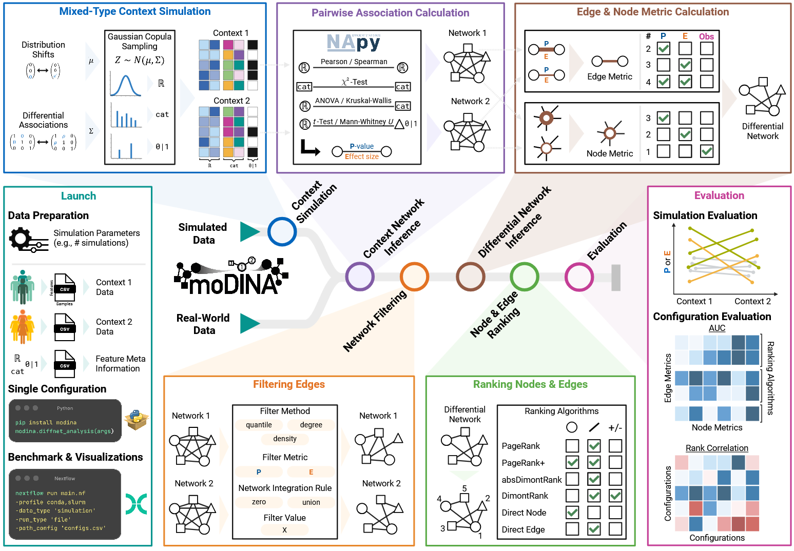

# moDiNA: Differential Network Analysis of Mixed-Type Multi-Omics Data 



The **moDiNA** pipeline facilitates **m**ulti-**o**mics **D**ifferential **N**etwork **A**nalysis in mixed-type data.
It compares two biologically distinct contexts and constructs a ranked differential network that captures both differentially abundant variables (nodes) and differential associations (edges).

The framework supports multiple data types, including continuous, binary, nominal, and ordinal categorical variables.
All processing steps are configurable through a user-defined configuration file, allowing flexible adaptation to different datasets and analysis goals.

Full documentation is available at [https://dyhealthnet.github.io/moDiNA](https://dyhealthnet.github.io/moDiNA/).

## Installation

**moDiNA** can be installed using Conda, Docker, or from source.  
If you face any issues, feel free to open a GitHub issue.

**Requirements:** Python 3.11

### With Conda 
Currently, the **moDiNA** package is only available on [GitHub](https://github.com/DyHealthNet/moDiNA).  

It is recommended to install **moDiNA** in a clean Conda ([Miniconda](https://www.anaconda.com/docs/getting-started/miniconda/main)) environment.  
We suggest using [Mamba](https://mamba.readthedocs.io/en/latest/installation/mamba-installation.html), a faster drop-in replacement for Conda that improves dependency resolution.  
Mamba is automatically installed when using [Miniforge](https://github.com/conda-forge/miniforge).

First, follow the installation instructions for your operating system.  
Then create and activate a new environment:

```bash
mamba create -n modina_env python=3.11
mamba activate modina_env
```

Next, install the package:

```bash
pip install git+https://github.com/DyHealthNet/moDiNA.git
```

### With Docker

**moDiNA** is available as Docker image.

Pull the image:

```bash
docker pull ghrc.io/dyhealthnet/modina:latest
```

Run the image:

```bash
docker run -it ghrc.io/dyhealthnet/modina:latest
```

### From Source

To install **moDiNA** from source, clone the repository and install the package using pip:

```bash
git clone https://github.com/DyHealthNet/moDiNA.git
cd moDiNA
pip install -e .
```


## Recommended Settings
Based on an extensive benchmark analysis performed on simulated data, we recommend the following pipeline configuration:

- Filtering: For reasonably small datasets, no filtering is required. For high-dimensional data, filtering can substantially reduce the runtime of moDiNA.
- Edge Metric: *pre-LS*
- Node Metric: *STC*
- Ranking Algorithm: *PageRank+*
