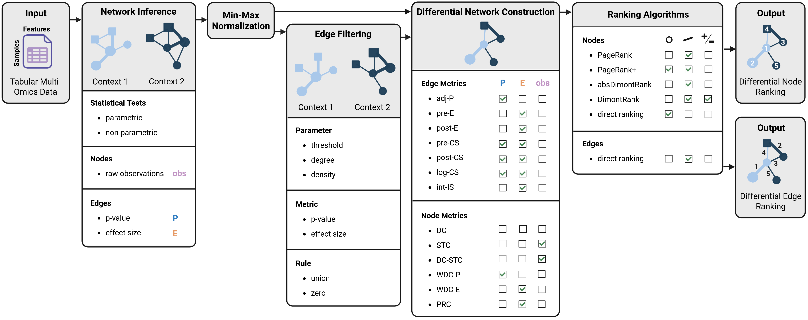

# moDiNA
The Python package moDiNA provides a customizable end-to-end pipeline to perform **m**ulti-**o**mics **D**ifferential **N**etwork **A**nalysis. It was developed based on an extensive benchmark analysis, evaluated using both simulated and real data.



- Input raw observational multi-omics data from two contexts of interest.
- Compute statistical association scores between all pairwise combinations of variables.
- Filter the context networks based on the association scores.
- Construct a differential network by aggregating edge and node information from both contexts.
- Rank the nodes and edges of the differential network to identify variables and correlations of interest exhibiting differential behaviour between contexts.

## Installation
It is strongly recommended to install moDiNA in a conda environment. Currently, the package is only available on GitHub. 

1. Install the package from the GitHub repository:
```bash
pip install git+https://github.com/DyHealthNet/moDiNA.git
```

2. Install NApy by following the instructions on https://github.com/DyHealthNet/NApy.

## Recommended Settings
