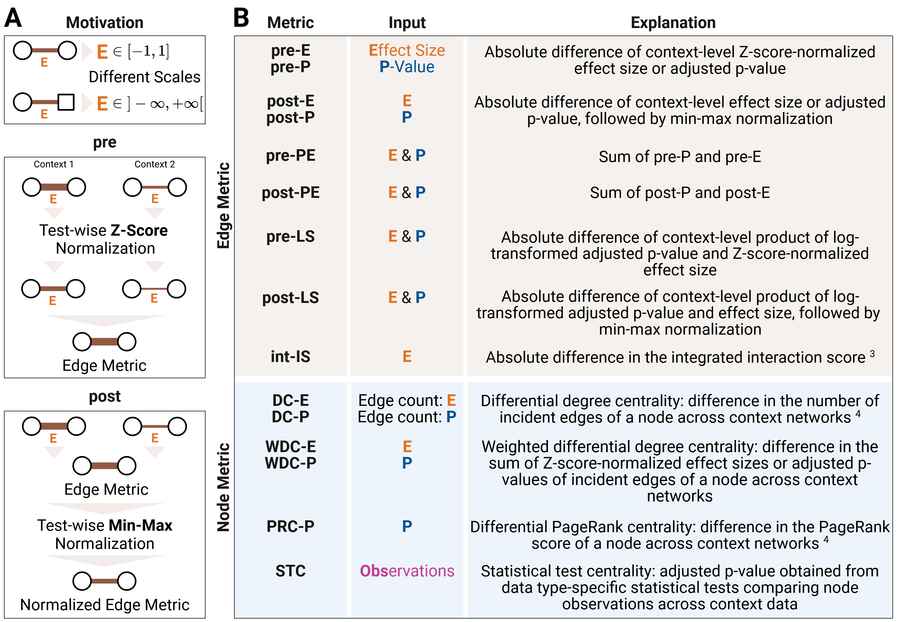

Python package
==============

In most cases, moDiNA can be conveniently used as a standalone Python package. 
For users interested in systematically comparing results across multiple moDiNA configurations, 
a dedicated :doc:`Nextflow pipeline <nextflow>` is provided.

Data Input
--------------

.. _real_world:

Real-World Data
~~~~~~~~~~~~~~~

To run **moDiNA** on your own data, you need two ``pandas`` DataFrames containing
the sample data from two biological conditions (e.g. healthy and diseased). 
Each row represents a sample, while each column corresponds to a variable.

Both DataFrames must contain the same set of variables. However, they may differ
in the number of samples, as samples are generally assumed to be independent.

The data type of each variable must be specified in a metadata file containing
two columns: ``label`` and ``type``. Supported variable types are
``continuous``, ``binary``, ``nominal``, and ``ordinal``. 
Categorical variables must be encoded as numerical values.

The tables below show an example of a context DataFrame and the corresponding metadata file.

.. table:: Context Data

   +--------+-----------+-----------+--------+---------------+-----------+
   |        | Protein_A | Protein_B | Gender | Disease_Stage | Ethnicity |
   +========+===========+===========+========+===============+===========+
   | S1     | 2.31      | 5.12      | 0      | 1             | 2         |
   +--------+-----------+-----------+--------+---------------+-----------+
   | S2     | 3.04      | 4.87      | 1      | 2             | 0         |
   +--------+-----------+-----------+--------+---------------+-----------+
   | S3     | 2.76      | 5.33      | 0      | 3             | 1         |
   +--------+-----------+-----------+--------+---------------+-----------+
   | S4     | 3.18      | 4.95      | 1      | 2             | 2         |
   +--------+-----------+-----------+--------+---------------+-----------+

.. table:: Metadata

   +----------------+-----------+
   | label          | type      |
   +================+===========+
   | Protein_A      | continuous|
   +----------------+-----------+
   | Protein_B      | continuous|
   +----------------+-----------+
   | Gender         | binary    |
   +----------------+-----------+
   | Disease_Stage  | ordinal   |
   +----------------+-----------+
   | Ethnicity      | nominal   |
   +----------------+-----------+

.. _simulations:

Simulated Data
~~~~~~~~~~~~~~

Alternatively, the ``simulate_copula`` function allows you to generate two synthetic biological contexts
with continuous, binary, and ordinal categorical variables, using Gaussian copula sampling.
The occurrence and magnitude of differential effects can be controlled via the input parameters, 
allowing users to introduce both differential abundance and differential associations between variables.
This approach is particularly useful for benchmarking **moDiNA** under controlled conditions.

Parameters:

- ``name1``, ``name2``: Names of the two biological contexts.
- ``n_cont``, ``n_bi``, ``n_cat``: Number of continuous, binary and ordinal variables per context, respectively.
- ``n_samples``: Number of samples per context.
- ``n_shift_*``: Number of variables with an artificial mean shift. Replace ``*`` with the variable type, e.g., ``n_shift_cont``, ``n_shift_bi``, ``n_shift_cat``.
- ``n_corr_*``: Number of variable pairs with a correlation difference. ``*`` represents the variable type combinations, e.g., ``n_corr_cont_cont``, ``n_corr_bi_cat``, etc.
- ``n_both_*``: Number of variable pairs with both a mean shift and a correlation difference. ``*`` represents variable type combinations as above.
- ``shift``: Approximate magnitude of the mean shift measured in standard deviations (differential abundance). Defaults to 0.5.
- ``corr``: Approximate magnitude of the correlation difference measured as correlation coefficient between 0 and 1 (differential association). Defaults to 0.7.
- ``path``: Optional path to save simulated contexts, metadata, and ground truth.

Returns:

A tuple ``(context1, context2, meta, ground_truth)``:

- ``context1``: pandas DataFrame of the first simulated context.
- ``context2``: pandas DataFrame of the second simulated context.
- ``meta``: pandas DataFrame containing the data type for each variable.
- ``ground_truth``: Tuple of three lists specifying the nodes with differential effects:
  
  - nodes with mean shifts,
  - nodes with correlation differences,
  - nodes with both mean shifts and correlation differences.

Example:

.. code-block:: python

    from modina.context_simulation import simulate_copula

    context1, context2, meta, ground_truth = simulate_copula(
        n_cont=30,
        n_bi=20,
        n_cat=10,
        n_samples=200,
        n_shift_cont=5,
        n_corr_bi_cat=2,
        n_both_cont_cat=2,
        shift=0.8,
        corr=0.6
    )

.. _analysis:
Differential Network Analysis
-----------------------------
The recommended way to use **moDiNA** is to execute the complete analysis pipeline via the ``diffnet_analysis()`` function.
It performs :ref:`context network inference <net_inference>`, :ref:`edge filtering <filtering>`, 
:ref:`differential network construction <diffnet>`, and :ref:`ranking <ranking>` of nodes and edges.
All configuration options can be specified directly through the function arguments.

Parameters:

- ``context1``, ``context2``: pandas DataFrames containing the observed data for the two contexts (rows: samples, columns: variables).
- ``meta_file``: pandas DataFrame specifying the variable metadata. Must contain the columns ``label`` and ``type`` describing each variable and its data type.
- ``edge_metric``: Edge-level metric used to compute the differential network. Options include ``'pre-P'``, ``'post-P'``, ``'pre-E'``, ``'post-E'``, ``'pre-PE'``, ``'post-PE'``, ``'pre-LS'``, ``'post-LS'``,  ``'int-IS'``.
- ``node_metric``: Node-level metric used to compute the differential network. Options include ``'DC-P'``, ``'DC-E'``, ``'WDC-P'``, ``'WDC-E'``, ``'PRC-P'``, ``'STC'``.  
- ``ranking_alg``: Ranking algorithm applied to the differential network. Options include ``'PageRank+'``, ``'PageRank'``, ``'absDimontRank'``, ``'DimontRank'``, ``'direct_node'`` and ``'direct_edge'``. Defaults to ``'PageRank+'``.
- ``filter_method``: Optional filtering method applied before constructing the differential network. Options include ``'quantile'``, ``'degree'``, ``'density'``. Per default, no filtering is performed.
- ``filter_param``: Parameter controlling the filtering strength.
- ``filter_metric``: Edge metric used for filtering.
- ``filter_rule``: Rule used to integrate the two networks during filtering. Options include ``'union'`` and ``'zero'``.
- ``max_path_length``: Maximum path length considered when computing integrated interaction scores. Defaults to ``2``.
- ``test_type``: Statistical test used for association score calculation. Options include ``'parametric'`` and ``'nonparametric'``. Defaults to ``'nonparametric'``.
- ``nan_value``: Numerical value used to replace missing values in the context data. If ``None``, an error is raised when missing values are present.
- ``correction``: Multiple testing correction method. Options include ``'bh'`` (Benjamini-Hochberg) or ``'by'`` (Benjamini–Yekutieli). Defaults to ``'bh'``.
- ``num_workers``: Number of parallel workers used during score computation. Defaults to ``1``.
- ``project_path``: Optional directory where intermediate results and output files will be stored.
- ``name1``, ``name2``: Names of the two contexts used for labeling and output file generation.

Returns:

A tuple ``(ranking, rankings_per_type, edges_diff, nodes_diff, config)``:

- ``ranking``: List containing the overall ranking of nodes or edges based on the selected ranking algorithm.
- ``rankings_per_type``: Dictionary containing rankings stratified by variable type. Type-specific rankings can be accessed using the keys ``'cont'``, ``'cat'``, and ``'bi'``.
- ``edges_diff``: pandas DataFrame containing the differential edge scores.
- ``nodes_diff``: pandas DataFrame containing the differential node scores.
- ``config``: Dictionary containing the configuration parameters used in the analysis.

Example:

.. code-block:: python

    from modina.pipeline import diffnet_analysis

    ranking, rankings_per_type, edges_diff, nodes_diff, config = diffnet_analysis(
        context1=context1,
        context2=context2,
        meta_file=meta,
        edge_metric='pre-LS',
        node_metric='STC',
        ranking_alg='PageRank+',
        filter_method='quantile',
        filter_param=0.5,
        filter_metric='pre-P',
        filter_rule='zero'
    )

.. note::
    If a specific step of the pipeline needs to be recomputed or adjusted, it may be useful to execute
    the analysis steps separately instead of rerunning the entire pipeline. 
    The individual steps are descibed below.

.. _net_inference:
Context Network Inference
~~~~~~~~~~~~~~~~~~~~~~~~~

To infer context-specific networks, the ``compute_context_scores`` function calculates association scores for a single biological context. 
Parametric (P) or non-parametric (NP) data type-specific tests and multiple testing correction is performed using `NApy <https://github.com/DyHealthNet/NApy>`_, 
which efficiently computes pairwise statistical tests and provides enhanced support 
for missing data. Missing values must be encoded as a common numerical value.
The resulting effect sizes and p-values quantify the strength of the relationships between variables 
and are used to construct a context-specific network, where variables are represented as nodes and association scores as weighted edges.

.. list-table::
   :header-rows: 1
   :widths: 25 20 15 40 10

   * - Test
     - Effect Size
     - Range
     - Data
     - Type
   * - Pearson
     - r
     - [-1, 1]
     - Cont–Cont
     - P
   * - Spearman
     - ρ
     - [-1, 1]
     - Cont–Cont, Cont–Ord, Ord–Ord
     - NP
   * - t-test
     - Cohen's d
     - (-∞, ∞)
     - Cont–Bin
     - P
   * - Mann–Whitney U
     - Cohen's d
     - (-∞, ∞)
     - Cont–Bin, Bin–Ord
     - NP
   * - ANOVA
     - Partial η²
     - [0, 1]
     - Cont–Nom
     - P
   * - Kruskal–Wallis
     - η²
     - [0, 1]
     - Cont–Nom, Ord–Nom
     - NP
   * - χ²-test
     - Cramer's V
     - [0, 1]
     - Bin–Bin, Bin–Nom, Nom–Nom
     - P, NP

Parameters:

- ``context_data``: pandas DataFrame containing the observed data (rows: samples, columns: variables).
- ``meta_file``: pandas DataFrame specifying the variable metadata. Must contain the columns ``label`` and ``type`` describing each variable and its data type.
- ``test_type``: Statistical tests used for network inference. Options include ``'parametric'`` and ``'nonparametric'``. Defaults to ``'nonparametric'``.
- ``correction``: Multiple testing correction method. Options include ``'bh'`` (Benjamini-Hochberg) or ``'by'`` (Benjamini–Yekutieli). Defaults to ``'bh'``.
- ``num_workers``: Number of parallel workers for computation. Defaults to ``1``.
- ``path``: Optional file path to save the computed scores as a CSV file. Defaults to ``None``.
- ``nan_value``: Numerical value used to replace missing values in the context data. If ``None``, an error is raised when missing values are present.

Returns:

A pandas DataFrame containing the computed association scores for all variable pairs.

Example:

.. code-block:: python

    from modina.context_net_inference import compute_context_scores

    scores = compute_context_scores(
        context_data=context1,
        meta_file=meta,
        test_type='nonparametric',
        correction='bh',
        num_workers=4,
        path='context1_scores.csv',
        nan_value=-999
    )

.. _filtering:
Edge Filtering
~~~~~~~~~~~~~~
The statistical network inference step produces fully connected networks, where every pair of variables is linked by an edge.
To reduce network complexity, insignificant edges with large p-values or small effect sizes can be removed using the ``filter`` function.

Three different filtering methods are available, all following the same basic principle: edges are first ordered
according to their association scores and then thresholded to achieve a desired network characteristic.
The ``quantile`` method retains only the strongest fraction of edges, the ``degree`` method reduces the network to a specified
average node degree, and the ``density`` method enforces a predefined network density by keeping only a certain percentage
of all possible edges. 

After filtering, there are two alternative rules for integrating the two networks.
The ``union`` rule retains all edges that are present in either network, preserving their original association scores.
This approach can recover edges that were eliminated in one network. However, the resulting context-specific networks remain structurally identical.
For edge metrics such as DC-P or DC-E, which rely solely on network topology, it is therefore recommended to use the ``zero`` rule instead.
Under the ``zero`` rule, removed edges are treated as missing and will be assigned insignificant p-values of 1.0 and effect sizes of 0.0 in downstream calculations.

Parameters:

- ``scores1``, ``scores2``: pandas DataFrames containing the statistical association scores for Context 1 and Context 2.
- ``context1``, ``context2``: pandas DataFrames with the raw context data for Context 1 and Context 2.
- ``filter_method``: Filtering method to apply. Options include ``'quantile'``, ``'degree'``, or ``'density'``. Defaults to None (no filtering).
- ``filter_param``: Parameter controlling the strength or threshold of the filtering method.
- ``filter_metric``: Edge metric used as the basis for filtering. Options include the adjusted p-value (use ``'pre-P'``) or the Z-score-normalized effect size (use ``'pre-E'``).
- ``filter_rule``: Rule used to integrate the two networks during filtering. Options include ``'union'`` and ``'zero'`` .
- ``path``: Optional path to save the filtered scores and context data as CSV files. Defaults to None.

.. warning::
    Currently, it is not recommended to use ``pre-E`` as a filter metric. Ordering and thresholding Z-score-normalized effect sizes
    can inadvertently remove highly important edges with large negative effect sizes. 
    This issue will be addressed in an upcoming update. In the meantime, please use ``pre-P`` instead.

Returns:

A tuple ``(scores1_filtered, scores2_filtered, context1_filtered, context2_filtered)``:

- ``scores1_filtered``, ``scores2_filtered``: pandas DataFrames containing the filtered association scores for each context.
- ``context1_filtered``, ``context2_filtered``: pandas DataFrames containing the raw context data for all variables that remain connected by at least one edge in the filtered networks.

Examples:

.. code-block:: python

    from modina.edge_filtering import filter

    # Quantile filtering
    scores1_filtered, scores2_filtered, context1_filtered, context2_filtered = filter(
        scores1=scores1,
        scores2=scores2,
        context1=context1,
        context2=context2,
        filter_method='quantile',
        filter_param=0.05,
        filter_metric='pre-P',
        filter_rule='union'
    )

    # Degree filtering
    scores1_filtered, scores2_filtered, context1_filtered, context2_filtered = filter(
        scores1=scores1,
        scores2=scores2,
        context1=context1,
        context2=context2,
        filter_method='degree',
        filter_param=5,
        filter_metric='pre-P',
        filter_rule='zero'
    )

    # Density filtering
    scores1_filtered, scores2_filtered, context1_filtered, context2_filtered = filter(
        scores1=scores1,
        scores2=scores2,
        context1=context1,
        context2=context2,
        filter_method='density',
        filter_param=0.8,
        filter_metric='pre-E',
        filter_rule='zero'
    )

.. note::
    Edge filtering can substantially reduce the runtime of **moDiNA** for large datasets. It is especially recommended
    when using the computationally heavy ``int-IS`` edge metric to construct the differential network. 

.. _diffnet:
Differential Network Construction
~~~~~~~~~~~~~~~~~~~~~~~~~~~~~~~~~

   **Figure 1:** Effect size normalization and definition of edge and node metrics. 
   Created with BioRender.com.

.. _ranking:
Ranking
~~~~~~~
